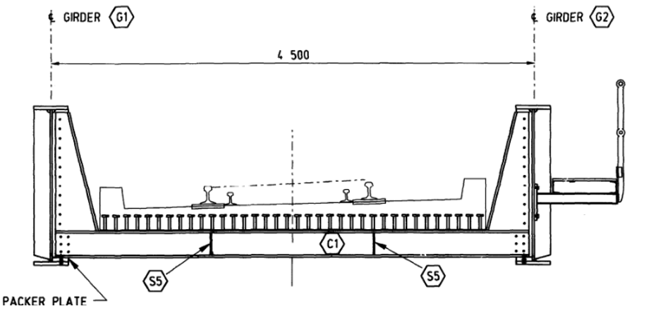
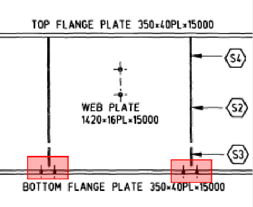
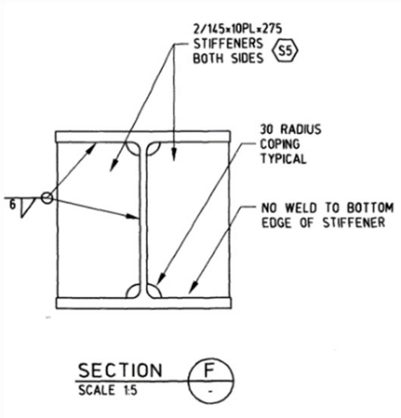
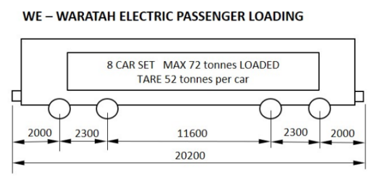
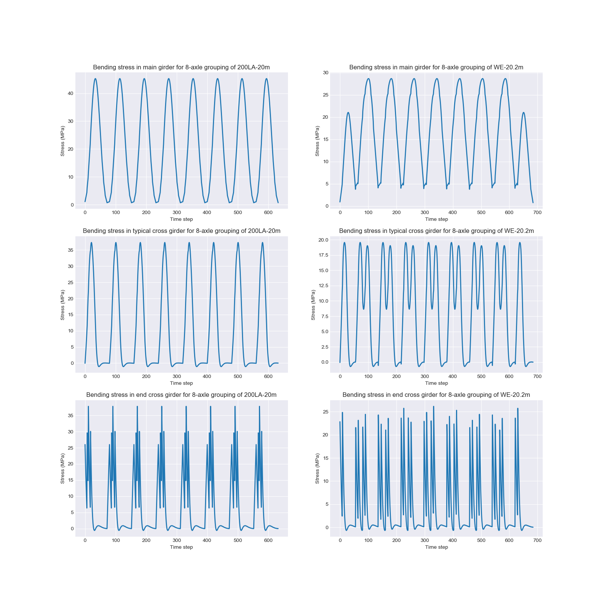
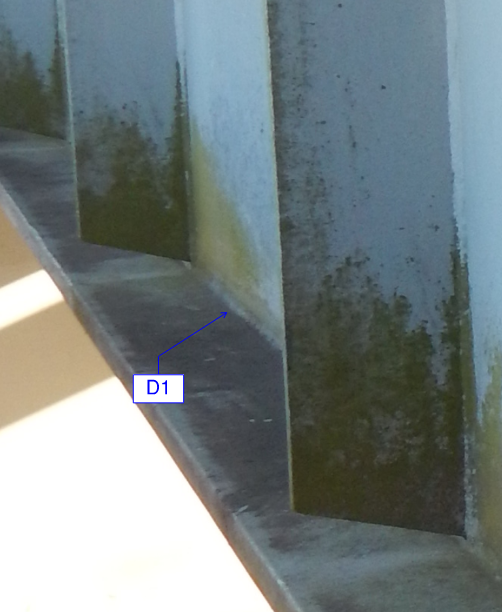
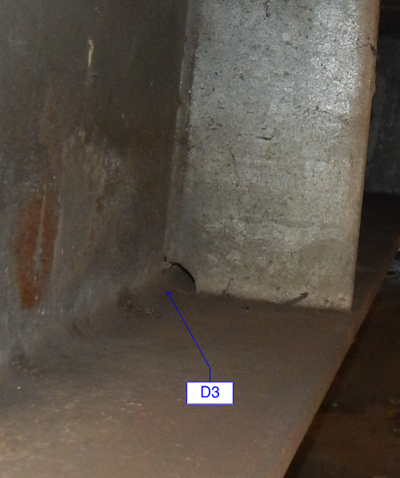

# Fatigue Assessment of a Through Girder Rail Bridge using AS 5100.2-2017

**[Luke Weatherstone](https://www.linkedin.com/in/luke-ww/)1, [Vahid Manoochehrikian](https://www.linkedin.com/in/vahidkian/)1, Ben Chung1**

1 GHD Pty Ltd

First published 24 November 2020.

---

## Abstract

_The revised AS 5100 Bridge Design suite, introduced in 2017, presented a number of significant changes from the 2004 suite. Notable among these were considerations of fatigue, specifically with AS 5100.6-2017._

_GHD has undertaken a fatigue analysis with details that are susceptible to fatigue damage. Our fatigue assessment of a rail bridge comprising welded through steel plate girders with composite cross girders to AS 5100 has indicated a number of issues including the following:_

1. _Determining the number of stress cycles in accordance with AS 5100.2-2017 can lead to an underestimation of the actual stress cycles;_

2. _Remaining life estimation using the equivalent stress method can lead to conservative result when compared to that from damage summation;_

3. _Inconsistency and lack of clarity in the S-N curves of AS 5100.6-2017 for number of cycles to failure in excess of 107. We have, in particular, identified some deficiencies in the proposed formulas for calculating the endurance for a given stress range; and_

4. _AS 5100 requires the capacity reduction factor is applied to the S-N curves. Other engineering disciplines and fatigue principles dictate the damage summation is a more relevant parameter than stress, so here is where the capacity reduction factor will logically apply._

## Background

The fatigue requirements for rail traffic in AS 5100.2-2017 are based on freight loads and a design life of 100 years. As the characteristics of passenger trains (including axle loads and number, and the daily number of trains) are vastly different to those of freight trains, a number of adjustments is required to AS 5100.2-2017 for structures which will primarily take passenger trains. As such, the June 2019 version of an ASA standard, T HR CI 12020 ST Underbridges, provides adjustments for the fatigue assessment of underbridges carrying passenger only rail traffic associated with the fatigue design traffic load, the base number of load cycles, the number of equivalent stress cycles and the effective number of stress cycles.

Fatigue is the process in which damage accumulates due to the cyclic application of loads. These loads can often be well below the material's yield point, which would lead a conventional stress analysis to indicate safety, when over a period of time, this is not the case.

Generally, the fatigue process can be thought of to occur at an internal or surface flaw where stresses are concentrated. Over repeated cycles, this flaw generates intrusions and extrusions that resemble a crack. When fatigue specimens are examined, region of slow crack growth is usually displayed around the location of the initial flaw. Eventually, the crack can become large enough to rapidly propagate through the material.

S-N diagrams are an empirical means of quantifying the fatigue process and designing for it. A constant cycle stress amplitude is applied to a specimen and the number of loading cycles until the specimen fails is determined.

When the cyclic loading on a structure is not constant, a cumulative damage model is often used to calculate the damage. The Palmgren-Miner rule is the most commonly used cumulative damage model. (Roylance, 2001)

## Introduction

For illustrative purposes, the fatigue assessment is undertaken on a 14.4 m span steel plate through-girder rail underbridge carrying passenger only traffic, comprising 1500 mm deep steel plate girders with 310UC118 cross girders at 1.52 m spacing supporting a 200 mm reinforced concrete deck with direct-rail fixation. Cross girders and deck act compositely due to the presence of shear studs along the top flange of the cross girders. The cross girders connect to the plate girders via a stiffener plate and tension-friction (TF) bolts. Figure 1 shows a cross section of the superstructure.

_Figure 1: Superstructure cross section_

This bridge sits on a passenger-only line. The assessment trains for the purpose of this paper will be the 200LA design load (in accordance with AS 5100.2-2017) and a Waratah Electric train (a typical passenger train in the urban network). These rail vehicles will be discussed further on.

For this paper, we will focus on two fatigue-critical details related to the plate girder and the cross girder. Table 1 presents these two details.

**Table 1: Fatigue details for consideration**

| Reference                                | Element                         | Detail category (MPa) | Detail reference (AS 5100.6-2017) | Comments                                                  | Design detail                                                  |
| ---------------------------------------- | ------------------------------- | --------------------- | --------------------------------- | --------------------------------------------------------- | -------------------------------------------------------------- |
| D1                                       | Plate girder bottom flange      | 90                    | Table 13.10.1(B), Detail 11       | Location of holes on bottom flange                        |            |
| D2 (D3 similar for the end cross girder) | Cross girder vertical stiffener | 80                    | Table 13.10.1(E), Detail 7        | Transverse weld attachment to the web and flange of 310UC |  |

While we will attempt to generalise where possible, our paper will present calculations for this short, single span steel railway bridge to highlight differences in the various methods discussed in the AS 5100 Bridge Design suite.

In order to determine the stresses in each of these details, we have modelled the bridge superstructure using the commercial structural analysis software SPACE GASS. We have prepared a grillage model to determine the nominal stress at the location of each detail.

Only the nominal stresses are considered from the global grillage analysis. Hot spot and notch stress methods are outside the scope of this paper.

## Determining the Number of Stress Cycles

The stress-time response of a structural element on a railway bridge is often of variable amplitude. For the assessment of existing bridges, AS 5100.7-2017 advises:

> _"When assessing a **road** bridge, an assessment of the historical loads and a related number of stress cycles shall be combined with the future loads and stress cycles in accordance with AS 5100.2."_

There is no mention of determining the number of cycles for a **rail** bridge, however we presume the intention of the code here applies to both types of bridge.

### Load History

In determining the number of stress cycles for a railway bridge, it is left to the engineer to first ascertain the loading history for the bridge. Determining the load history for a structure is a very complex task, particularly with bridges, which may have been in operation for many decades.

While effort should be made by the assessing engineer to determine the loading history for the structure (or at least to make some conservative assumptions), there may be instances where this is highly impractical. In these instances, the engineer would turn to AS 5100.7-2017 and AS 5100.2-2017 for guidance.

### Effective Number of Stress Cycles with AS 5100.2-2017

At present, AS 5100.2-2017 contains no information on calculating an effective number of cycles for an existing bridge. However, AS 5100.2-2017 specifies the base number of load cycles in Table 9.8.3, CT, which is based on a design life of 100 years. (Standards Australia, 2017). The CT factor in the standards is based on studies performed on bridges in the USA with assumptions on the number of trains per day and number of coupled units per train. (Standards Australia, 2007)

The subject bridge carries a passenger-only line (and has done so for its entire life). For a line of this type, AS 5100.2 Supp 1 - 2007 assumes 20 trains per day for 100 years. With adjustments to the number of trains, AS 5100.2-2017 calculates a base number of load cycles of 1 &times; 105 for this particular line.

In calculating the cumulative fatigue damage, the engineer usually adjusts the base load cycles for the life of the assessed bridge. There is currently no guidance on how to adjust this value for a design life less than 100 years. From the authors' conversations, popular choices appear to be linear interpolation and fitting an exponential growth model. Additionally, the number of cycles calculated in AS 5100.2-2017 are based on an assumption that the design engineer will convert the **variable** amplitude stress-response to a **constant** amplitude stress response. This is a reasonable assumption for **new** bridges due to the uncertainty of future loading. Where this falls down is when dealing with existing bridges and/or bridges carrying passenger-only trains.

From C8.7.3 of AS 5100.2 Supp 1 - 2007:

> _"the actual number of cycles of variable amplitude... is replaced by an equivalent number of constant amplitude stress cycles of the fatigue design stress range."_

Table 9.8.3 of AS 5100.2-2017 provides equations for calculating nT, the number of equivalent stress cycles of constant amplitude per train, which depends on Lf -- the span of main girders, trusses or stringers; or cross-girder spacing for cross-girders, and Lv -- the distance between the centres of axle groups. In AS 5100.2-2017, the value of nT, based on the design 300LA loading, varies between 12 and 20. Table 2 summarises the values of Lf, Lv, nT, CT and n100 for the subject bridge.

**Table 2: Effective number of cycles for a 100 year design (n100) by AS 5100.2-2017**

| Element      | Lf | Lv | nT | CT            | n100 |
| ------------ | ------------- | ------------- | ------------- | ------------------------ | --------------- |
| Plate girder | 14.4          | 20            | 60            | 1 &times; 105 | 6,000,000       |
| Cross girder | 1.52          | Any           | 240           | 1 &times; 105 | 24,000,000      |

Note we have only reported the number of effective cycles considering an axle group spacing of 20+ m.

Since these effective number of cycles are based on a 100 year design life, for assessment we need to convert them to the age of the structure. In this case, the structure is 25 years old. The calculation of CT by AS 5100 is based on a linear relationship between the total number of trains, ntrains and the number of years, tyears. (Standards Australia, 2007)

> CT &prop; ntrains &times; tyears &emsp; _(Eq. 1)_

Therefore, it is considered reasonable to use a linear adjustment to reduce the value for a younger structure, refer to Table 3. Note that growth rate effects of the number of trains will not be included in this model and is a downside of this approach.

**Table 3: Number of trains for a 25-year life (n25) by AS 5100.2-2017**

| Element      | Lf | Lv | nT | CT            | n100 | n25 |
| ------------ | ------------- | ------------- | ------------- | ------------------------ | --------------- | -------------- |
| Plate girder | 14.4          | 20            | 60            | 1 &times; 105 | 6,000,000       | 1,500,000      |
| Cross girder | 1.52          | Any           | 240           | 1 &times; 105 | 24,000,000      | 6,000,000      |

The engineer can now use these values with the maximum constant amplitude fatigue stress range to calculate the remaining fatigue life of the element in question.

### Estimating the Actual Number of Trains

Where the loading-time history is completely known -- rail vehicle weight, axle spacing, speed, etc. -- the designer can determine the resulting theoretical stress resultants, noting that the load distribution in the structural model is often flawed, as actual strains do not often correlate with theoretical strains, especially where dynamic load factor is applied.

We know that, in 2019, the subject bridge experienced 81 Waratah Electric trains per day.

Over the years, the number of trains a bridge will experience invariably change. Standard practice is to use an exponential model for growth in the number of trains passing over the bridge.

> yt = y0(1 + r)t &emsp; _(Eq. 2)_

Where:

- yt is the predicted number of trains per year;
- y0 the number of trains per year in the reference year (2019);
- r is the growth rate as a decimal (1% or 2%); and
- t is the integer time with respect to the reference year (i.e. t2019 = 0).

Rail bridges often have a design life of 100 to 120 years. Our exponential growth model can calculate an expected number of trains for each of these time periods, refer to Table 4.

**Table 4: Number of trains for various exponential growth scenarios**

| Growth rate      | Trains per day in 2019                    | Trains through 2019 (25 years) | Trains through 2094 (100 years) | Trains through 2114 (120 years) |
| ---------------- | ----------------------------------------- | ------------------------------ | ------------------------------- | ------------------------------- |
| 0.001 | 20 (AS 5100.2-2017 reference)2 | 182,500                        | 730,000                         | 876,000                         |
| 0.001 | 81                                        | 768,690                        | 2,986,065                       | 3,557,365                       |
| 0.01             | 81                                        | 680,679                        | 3,992,609                       | 5,379,365                       |
| 0.02             | 81                                        | 606,775                        | 5,757,223                       | 8,992,789                       |

1 A growth rate of 0.00 indicates the same number of trains will pass over the bridge each year.

2 The effective number of cycles is the product of the base number of cycles (CT) and the number of equivalent stress cycles per train (nT). This implies that CT is actually the number of trains. For the subject bridge, the commentary to AS 5100.2 (2007 commentary) describes how this CT factor is based on an assumption of 20 trains per day.

The question of which growth rate parameter to use is challenging. In practice, the engineer can consider a range of values to perform a sensitivity check or make conservative assumptions. For our purposes, we will adopt a growth rate of 0.01.

We can see that all these values are considerably higher than the number of trains calculated using AS 5100.2-2017's 20 trains per day assumption.

### Stress Time History Per Train

In addition to the number of trains the bridge has experienced to date (and will experience in the future), the engineer will need to determine the number and magnitude of the fatigue stress cycles on the structure from each train. This requires development of an analytical model of the bridge, where the load-time response of the structure can be appropriately assessed. The geometry and material properties of the elements is critical in determining the response of the structure. Typically, shorter members (e.g. cross girders) will receive a higher number of stress cycles than their longer cousins (e.g. main girders).

For the subject bridge, we have modelled two rail vehicle scenarios. One for a 200LA load as a direct comparison with AS 5100-2017 and another for a Waratah Electric load which is the typical train operating on the bridge, refer to Figure 2.

_Figure 2: Waratah Electric loading diagrams_

We present the stress-time response graphs for 8-carriage sets of 200LA and Waratah Electric wagons for both the main girders and cross girders in Figure 3 below. A Waratah Electric train typically operates as an 8-carriage set, however for the 200LA load, the Australian Standards give no indication on the number of axle groups to consider for a fatigue assessment. Given the standard 8-carriage set, as well as guidance from the NSW specific T HR CI 12020 ST (Transport for NSW, 2019), we have adopted an 8 axle group set of 200LA, removing the leading simulated locomotive.

For the cross girders, we have shown a typical cross girder around the mid-span of the bridge, as well as an end cross girder at the beginning of the bridge. We can see that the end cross girder experience a significantly more varied stress response. AS 5100.2-2017 allows for this varied load effect by considering a larger dynamic load allowance, through a reduced L&alpha; (leading to an increased &alpha; limited to a value of 0.67), given in Table 9.5.2 of AS 5100.2-2017. We have also highlighted this difference in Table 3 below.

Main girder and cross girders stress histories for two different loading scenarios are shown in Figure 3.

_Figure 3: Stress-time responses for main girders and a typical cross girder under 200LA and Waratah Electric (WE) loading_

While the stress-time response for the main girder follows a predictable pattern, we can see in Figure 3 the cross girder, particularly for the Waratah Electric loading, experiences a repetitive but varied loading pattern.

Appendix I of AS 5100.6-2017 advises that these stress histories should be evaluated by either the _rainflow method_ or _reservoir method_ to determine:

- Stress ranges and their associated number of cycles; and
- Mean stresses, where the mean stress influence needs to be taken into account.

For distinct stress peaks, particularly those experienced by the main girder under 200LA loading (the top left chart in Figure 3), the constant amplitude stress assumption is reasonable. The stress cycles can be easily read off the graph. For a more abstract loading like the one experienced by the cross girder under WE loading (bottom right chart in Figure 3), it is less clear to read and an algorithm is needed.

#### Rainflow Cycle Counting Algorithm

We have adopted the rainflow method for the purpose of this study. The rainflow-counting algorithm is used on fatigue data to convert our varying stress-time graphs in Figure 3 into an equivalent set of stress **reversals** and their associated number of cycles. By applying this method, the fatigue damage cycles can be extracted from the sequence, which models the material memory effect seen with stress-strain hysteresis cycles (Endo, et al., 1974). The fatigue life of a component can then be determined for each rainflow cycle using the Palmgren-Miner rule for the fatigue damage (as we have done in this paper), or the crack growth equation to calculate the crack increment (Sunder, et al., 1984).

For the stress-time responses presented in Figure 3, Table 5 presents a summary of the resulting stress ranges and their associated number of cycles per train.

**Table 5: Stress range cycles for main girders and cross girders for a Waratah Electric and 200LA train loading**

| Element              | Train            | Min. stress (MPa) | Max. stress (MPa) | Stress range (MPa) | Cycles per 8-carriage group |
| -------------------- | ---------------- | ----------------- | ----------------- | ------------------ | --------------------------- |
| Main girder          | Waratah Electric | 0.8               | 28.7              | 27.9               | 1                           |
|                      |                  | 3.8               | 28.7              | 24.8               | 5                           |
|                      |                  | 3.8               | 21.3              | 17.4               | 2                           |
|                      | 200LA            | 0.7               | 45.3              | 44.6               | 7                           |
|                      |                  | 1.4               | 45.3              | 43.9               | 1                           |
| Typical cross girder | Waratah Electric | -0.7              | 19.6              | 20.3               | 9                           |
|                      |                  | 8.8               | 18.9              | 10.1               | 7                           |
|                      | 200LA            | -1.1              | 37.4              | 38.4               | 8                           |
| End cross girder     | Waratah Electric | -0.7              | 27.4              | 28.1               | 3                           |
|                      |                  | -0.7              | 26.5              | 27.2               | 5                           |
|                      |                  | -0.3              | 25.6              | 25.9               | 8                           |
|                      |                  | 2.8               | 24.8              | 22.0               | 16                          |
|                      | 200LA            | -0.6              | 39.6              | 40.2               | 8                           |
|                      |                  | 6.9               | 31.4              | 24.5               | 8                           |
|                      |                  | 6.9               | 27.0              | 20.1               | 8                           |
|                      |                  | 15.7              | 30.8              | 15.1               | 8                           |

## Calculating the Stress Ranges with Australian Standards

To appropriately compare the methodology we have proposed with the Australian Standards, we need to calculate the nominal stress range in accordance with Clause 13.9.2 of AS 5100.6-2017.

There are two ways to approach this.

In the first approach, the effective number of cycles is calculated as per AS 5100.2-2017 and this can be used to obtain the fatigue strength from the appropriate S-N curve. Then, the maximum nominal stress (including dynamic allowance) will be compared with fatigue strength.

The second approach is to calculate an **equivalent** nominal stress range for **2 million cycles**. Fatigue strength will be the same as fatigue category at 2 million cycles. Capacity reduction factor for both approaches is applied on fatigue strength or alternatively on the limit side of the AS 5100.6 2017 equations.

### Equivalent Nominal Stress Range

The equivalent nominal stress range is given by:

> &Delta;&sigma;nom = (1 + &alpha;) &lambda; &times; &Delta;&sigma;max &emsp; _(Eq. 3)_

Where:

- &alpha; is the dynamic load allowance (DLA);
- &lambda; is the calculated damage equivalent factor; and
- &Delta;&sigma;max is the maximum stress range caused by the fatigue loads.

Table 6 below shows the resulting nominal stress ranges for the two primary structural elements. Note the cross girder elements are being punished by three different factors. The dynamic load allowance and effective number of cycles increases as cross girders are closely spaced and thus the damage equivalent factor increases. The result is a more than three-fold increase to the nominal stress (up to 138.6 MPa) from the unfactored maximum stress range in the fatigue load case. It is worth noting that end cross girder stresses are increased in comparison with typical cross girders due to reduction in vertical flexibility of main girders at each end and reduced compression zone in the cast in-situ deck at the end of main girders.

**Table 6: Equivalent nominal stress ranges for main girders and cross girders, determined in accordance with Clause 13.9.2 of AS 5100.6-2017**

| Element              | DLA &alpha;      | Train            | n100 | &lambda;100 | &lambda;25 | &Delta;&sigma;2 | &Delta;&sigma;nom.100 | &Delta;&sigma;nom.25 |
| -------------------- | ---------------- | ---------------- | --------------- | ---------------------- | --------------------- | -------------------------- | -------------------------------- | ------------------------------- |
| Main girder          | 0.33             | Waratah Electric | 6e6             | 1.245                  | 1.038                 | 37.1                       | 46.2                             | 38.5                            |
|                      |                  | 200LA            | 6e6             | 1.245                  | 1.038                 | 59.3                       | 73.9                             | 61.6                            |
| Typical cross girder | 0.67             | Waratah Electric | 24e6            | 2.064                  | 1.720                 | 33.9                       | 70.0                             | 58.3                            |
|                      |                  | 200LA            | 24e6            | 2.064                  | 1.720                 | 64.1                       | 132.4                            | 110.3                           |
| End cross girder     | 0.671 | Waratah Electric | 24e6            | 2.064                  | 1.720                 | 47.0                       | 96.9                             | 80.8                            |
|                      |                  | 200LA            | 24e6            | 2.064                  | 1.720                 | 67.2                       | 138.6                            | 115.5                           |

1 While the dynamic load effect for the end cross girder is approximately 50% more than the typical cross girder, AS 5100.2-2017 places an upper limit on the dynamic allowance for bending effects of 0.67.

2 This is the maximum stress multiplied by the dynamic load allowance.

### Nominal Stress Range

The nominal stress range is the maximum stress, multiplied by the dynamic load allowance. This value is used in conjunction with the fatigue strength from S-N curves to give the fatigue damage.

## Comparing the Methods

From Table 5 and Table 6, we can now prepare a comparative table with the stress ranges and cycles we'll be using for the fatigue damage summation.

**Table 7: Comparison of the stresses and number of cycles for the AS 5100.2-2017 method and method proposed by the authors (for assessment at 25 years)**

| Element              | Train | Equiv. stress1 &Delta;&sigma; | Equiv. stress n | Nominal stress2 &Delta;&sigma; | Nominal stress n | Damage sum.3 &Delta;&sigma; | Damage sum. n                                  |
| -------------------- | ----- | ---------------------------------------- | --------------- | ----------------------------------------- | ---------------- | -------------------------------------- | ---------------------------------------------- |
| Main girder          | WE    | 38.5                                     | 2,000,000       | 37.1                                      | 1,500,000        | 37.1 / 33.0 / 23.1                     | 680,700 / 3,403,400 / 1,361,400                |
|                      | 200LA | 61.6                                     | 2,000,000       | 59.3                                      | 1,500,000        | 59.3 / 58.4                            | 4,764,800 / 680,700                            |
| Typical cross girder | WE    | 58.3                                     | 2,000,000       | 33.9                                      | 6,000,000        | 34 / 17                                | 6,126,100 / 4,764,800                          |
|                      | 200LA | 110.3                                    | 2,000,000       | 64.1                                      | 6,000,000        | 64                                     | 5,445,400                                      |
| End cross girder     | WE    | 80.8                                     | 2,000,000       | 46.9                                      | 6,000,000        | 46.9 / 45.4 / 43.3 / 36.7              | 2,040,000 / 3,400,000 / 5,450,000 / 10,900,000 |
|                      | 200LA | 115.5                                    | 2,000,000       | 67.2                                      | 6,000,000        | 67 / 41 / 34 / 25                      | 5,445,400 / 5,445,400 / 5,445,400 / 5,445,400  |

1 Using equivalent stresses and 2 million cycles for each one.

2 Using the nominal stresses and the number of equivalent cycles calculated with the standards.

3 Rainflow cycle counting method adopted to calculate the stress range and their associated number of cycles. Number of trains traversing in the future will be estimated by adopting exponential growth rate.

Table 7 shows that both the stresses and number of cycles for the two methods are wildly different. The AS 5100.2-2017 equivalent nominal stress values are considerably higher to allow for number of cycles and associated fatigue damage, leading to a conservative assessment, while the damage summation method with exponential growth yields significantly higher cycles. In the following sections we will see the impact of these methods on the remaining life of the structure.

## Using Strength-Endurance Curves for Fatigue Assessment

Every structural detail has a resistance to fatigue damage -- a number of cycles it can safely resist for a given stress range. As the stress range reduces, the number of cycles the material can resist increases. The relationship between stress range and number of cycles is defined by a fatigue strength endurance curve, or commonly known as an _S-N curve_.

AS 5100.6-2017 is the applicable code for the design of steel and composite section bridges. In Section 13.10, it provides the engineer with both equations and an S-N curve diagram to determine the number of resistance cycles (or the maximum stress range for a given number of cycles) for a particular detail category.

### AS 5100.6-2017 S-N Curve Equations

To determine these curves, the Standards provide the equations.

For **constant** amplitude nominal stress ranges **above** the knee point on the S-N curve:

> &Delta;&sigma;Rm NR = &Delta;&sigma;Cm &times; 2 &times; 106 with m = 3 for N &le; 107 &emsp; _(Eq. 4)_

> &Delta;&tau;Rm NR = &Delta;&tau;Cm &times; 2 &times; 106 with m = 5 for N &le; 108 &emsp; _(Eq. 5)_

For **constant** amplitude stress ranges **below** the knee point:

> &Delta;&sigma;Rm NR = 0.585 &Delta;&sigma;Cm &times; 2 &times; 106 with m = 22 for N > 107 &emsp; _(Eq. 6)_

> &Delta;&tau;Rm NR = 0.457 &Delta;&tau;Cm &times; 2 &times; 106 with m = 22 for N > 108 &emsp; _(Eq. 7)_

For **variable** amplitude nominal stress ranges **below** the knee point:

> &Delta;&sigma;Rm NR = 0.585 &Delta;&sigma;Cm &times; 2 &times; 106 with m = 5 for N > 107 &emsp; _(Eq. 8)_

> &Delta;&tau;Rm NR = 0.457 &Delta;&tau;Cm &times; 2 &times; 106 with m = 9 for N > 108 &emsp; _(Eq. 9)_

When plotting these equations, there is a mathematical error at the knee point. For the stress ranges below the knee point, the 0.585 and 0.457 factors are causing an offset. To correct this error, we propose to replace these hard-coded factors with a dynamic factor, which we'll call &beta;. This factor is calculated by letting the equations above and below the knee point be equal.

m1 and m2 are above and below the knee point slopes of the S-N curve respectively. A summary of m1 and m2 values as documented in AS 5100.6-2017 are shown in Table 8 below.

**Table 8: S-N Curve slope**

| S-N Curve Slope                      | Constant amplitude stress |                              |              | Variable amplitude stress |                              |              |
| ------------------------------------ | ------------------------- | ---------------------------- | ------------ | ------------------------- | ---------------------------- | ------------ |
|                                      | Normal stress             | Normal stress (160 MPa only) | Shear stress | Normal stress             | Normal stress (160 MPa only) | Shear stress |
| m1 (Above the knee point) | 3                         | 5                            | 5            | 3                         | 5                            | 5            |
| m2 (Below the knee point) | 22                        | 22                           | 22           | 5                         | 5                            | 9            |

By applying the more generic &beta; factor, the curves connect at the knee point which makes intuitive sense. Having these equations allow us to perform more detailed and precise calculations.

## Application of the Capacity Reduction Factor

AS 5100.6-2017 explicitly requires the capacity reduction factor, &phi;, to be applied to the S-N curve to determine the number of cycles a fatigue detail can endure. In other industries it is typical to apply the capacity reduction factor to the damage sum instead. This is consistent with the principles of fatigue where damage is the principal criteria, not stress.

Application of the capacity reduction factor to the S-N curve or damage sum yield considerably different results. We believe applying the factor to the damage limit is more appropriate.

## Remaining Life Estimation

### Cumulative Damage

For each particular detail, the engineer is required to determine 1) the fatigue stress ranges experienced by the detail; 2) the number of cycles for each stress range; 3) the type of stress; and 4) the fatigue resistance of the detail. We have presented two details from Section 13 of AS 5100.6-2017, however further discussion of detail categories is outside the scope of this paper.

Since we have a variable amplitude loading, a cumulative damage model is now required. The model specified in AS 5100.6-2017 (and most common) is the Palmgren-Miner rule.

> Dd = &Sigma;(ni / Ni) &emsp; _(Eq. 10)_

Where:

- Dd is the damage to the fatigue detail for the assessment period;
- ni is the number of cycles which occur at a particular stress range; and
- Ni is the endurance (in cycles) at a particular stress range.

While this rule is simple to use, it does have numerous drawbacks. Firstly, it assumes a linear relationship for damage accumulation and does not account for the non-linearity of crack propagation and damage to a detail.

Secondly, the rule does not take into account the sequencing effects of stresses. The order a detail experiences the stresses can be important in the resulting damage.

Lastly, and perhaps most importantly, numerous tests indicate that the Palmgren-Miner sum can vary wildly at failure, both conservatively and unconservatively. While discussion of other fatigue damage models is outside the scope of this paper, we mention the drawbacks of the Palmgren-Miner rule to highlight the uncertainty in the damage summation and remaining life results.

### Remaining Life

The code then advises that the remaining life is simply the inverse of the damage sum multiplied by the assessment period.

> R(Remaining life) = Assessment years / Dd - Assessment years &emsp; _(Eq. 11)_

This approach makes sense for a structure that is expected to experience the same loading cycles year after year, which is what we may do for design. For assessment of an existing structure, however, this approach is not correct, and we must consider the growth of the number of trains (as with exponential growth) to calculate when the structure will reach the end of its life.

Using the stresses, cycles and details in Table 7 we have calculated the remaining life. Note the modified S-N curves were used for both methods.

**Table 9: Damage summations for the two details assessed at 25 years**

| Detail | Train | Method            | &phi; to S-N curve D | RAS 5100 | RD.sum | &phi; to Damage Limit D | RAS 5100 | RD.sum |
| ------ | ----- | ----------------- | -------------------- | ------------------- | ----------------- | ----------------------- | ------------------- | ----------------- |
| D1     | 200LA | Equivalent stress | 0.43                 | 33.5                | N/A               | 0.32                    | 53.0                | N/A               |
|        |       | Constant stress   | 0.29                 | 62.4                | N/A               | 0.21                    | 91.5                | N/A               |
|        |       | Damage summation  | 1.03                 | -0.7                | 0                 | 0.77                    | 7.3                 | 7                 |
|        | WE    | Equivalent stress | 0.00                 | > 120               | N/A               | 0.00                    | > 120               | N/A               |
|        |       | Constant stress   | 0.00                 | > 120               | N/A               | 0.00                    | > 120               | N/A               |
|        |       | Damage summation  | 0.06                 | 377.9               | 150               | 0.05                    | 512.2               | 175               |
| D2     | 200LA | Equivalent stress | 3.49                 | -17.8               | N/A               | 2.62                    | -15.5               | N/A               |
|        |       | Constant stress   | 2.06                 | -12.9               | N/A               | 1.54                    | -8.8                | N/A               |
|        |       | Damage summation  | 1.87                 | -11.6               | -11               | 1.40                    | -7.2                | -6                |
|        | WE    | Equivalent stress | 0.52                 | 23.4                | N/A               | 0.39                    | 39.6                | N/A               |
|        |       | Constant stress   | 0.00                 | > 120               | N/A               | 0.00                    | > 120               | N/A               |
|        |       | Damage summation  | 0.17                 | 124.5               | 77                | 0.13                    | 174.4               | 96                |
| D3     | 200LA | Equivalent stress | 4.01                 | -18.8               | N/A               | 3.01                    | -16.7               | N/A               |
|        |       | Constant stress   | 2.37                 | -14.5               | N/A               | 1.78                    | -10.9               | N/A               |
|        |       | Damage summation  | 2.80                 | -16.1               | -15               | 2.02                    | -12.6               | -12               |
|        | WE    | Equivalent stress | 1.37                 | -6.8                | N/A               | 1.03                    | -0.7                | N/A               |
|        |       | Constant stress   | 0.81                 | 5.8                 | N/A               | 0.61                    | 16.1                | N/A               |
|        |       | Damage summation  | 1.67                 | -10                 | -9                | 1.05                    | -1.1                | -1                |

The data in Table 9 above suggest that for a 200LA loading, it is likely these details are nearing the end of their fatigue life. Fortunately, the bridge does not experience 200LA loading in reality. This is a fictional design load.

The photographs in Figure 4 show these details on the bridge at 25 years of age. While no substitute for magnetic particle testing and other non-destructive weld testing techniques, a visual inspection of the welds shows they are in good condition with no signs of structural distress.

|  |  |
| -------------------------------------------------------- | -------------------------------------------------------- |

_Figure 4: Photographs of welds on site. Left: detail 1 (D1) for the plate girder. Right: detail 3 (D3) for the end cross girder (D2 similar)_

As such, it would be surprising to see remaining lives of anything less than 50 years under the Waratah Electric loading scenario. On the basis of the above table, it is clear that in some instances, the damage equivalent factors are too onerous for assessment of existing structures. Just using the maximum stress as the constant stress in contrast, misses out on slightly lower fatigue stress cycles and tends to underestimate the damage.

**We believe that performing a damage summation method using an exponential growth model and the rainflow-counting algorithm is the most accurate way to assess existing steel bridges.**

## Conclusions

After performing a thorough review of the Australian Standards' approach to fatigue for steel bridges and application to a 14.4 m span steel plate through-girder rail underbridge carrying passenger only traffic, the conclusions and recommendations are as follows:

### S-N Curve Equations Need to Be Updated

One of the most glaring conclusions is the need for modified S-N curve equations in AS 5100.6-2017. Equations provided below the knee point are incorrect and other equations contain numerous typographical errors. We have provided updated equations in this paper for consideration and recommend the standard is updated to include these.

### Use Real Loads to Assess

While this makes intuitive sense, the guidance given in AS 5100 encourages using the design "LA" loadings for assessment of existing bridges. Our results show that this is overly conservative and is more appropriate for theoretical methods (i.e. new design) where the loading profile on the structure is unknown. When the load history of a structure is known (or when the engineer can make a reasonable assessment of the past loading), this should always be used, along with the specific rail vehicles which have used the bridge.

Additionally, since the LA loads from AS 5100 are theoretical, the number of cycles (a very important parameter) are uncertain. The equivalent nominal stress method attempts to reduce the complexity of predicting the number of cycles accurately, but fails to capture nuance.

### Perform a Fatigue Cycle Counting Method

When assessing real loads, the engineer should perform a fatigue cycle counting method to count the fatigue damage events, which occur at each detail. In this paper we have used the rainflow-counting algorithm. By failing to perform such a method, the engineer risks missing a significant number of fatigue damage cycles. These are usually of a slightly lower range, however are large enough to cause appreciable damage to the detail.

### Damage Equivalent Factors Are Too Conservative

Due to the nonlinear nature of the S-N curves and the significance of fatigue damage as distinct to stresses, a two-fold increase in the stress range results in a much larger than two-fold reduction in the number of cycles the material can resist. Based on our findings, we believe the damage equivalent factors are too conservative for assessment of existing structures. They are simply not able to capture the nuances of a non-linear S-N curve, let alone deal with the nuance of the knee point.

### More Guidance on the Capacity Reduction Factor Is Needed

While AS 5100.6-2017 is clear on how the engineer should apply the capacity reduction factor, we have found that applying the factor to the S-N curves is a conservative approach. By instead using the factor with the damage limit, a safe but more realistic result could be obtained.

## Acknowledgement

Sincere thanks for Joe Muscat of ASA for reviewing the paper.

## References

1. Chong, K., 2019. _GL C 10604 Fatigue Assessment of Underbridges,_ s.l.: Sydney Trains.
2. Endo, T. et al., 1974. Damage evaluation of metals for random or varying loading -- three aspects of rain flow method. _Mechanical Behavior of Materials,_ pp. 371-380.
3. Roylance, D., 2001. Fatigue. In: _Mechanics of Materials._
4. Standards Australia, 2007. _AS 5100.2 Supplement 1 - Bridge design - Design loads - Commentary,_ s.l.: Standards Australia.
5. Standards Australia, 2017. _AS 5100.2 Bridge design Part 2: Design loads,_ s.l.: Standards Australia.
6. Standards Australia, 2017. _AS 5100.6 Bridge design Part 6: Steel and composite construction,_ s.l.: Standards Australia.
7. Standards Australia, 2017. _AS 5100.7 Bridge design Part 7: Bridge assessment,_ s.l.: Standards Australia.
8. Sunder, R., Seetharam, S. A. & Bhaskaran, T. A., 1984. Cycle counting for fatigue crack growth analysis. _International Journal of Fatigue,_ pp. 147-156.
9. Transport for NSW, 2019. _T HR CI 12020 ST Underbridges,_ s.l.: TfNSW.
